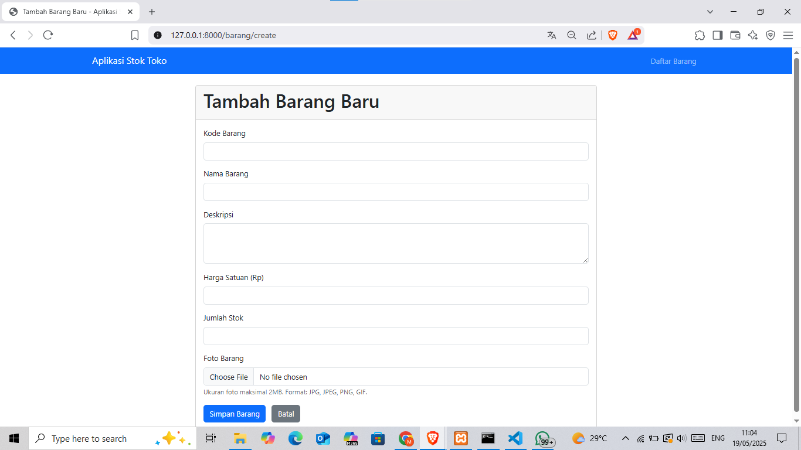

# Aplikasi CRUD Stok Barang - Versi Laravel

Aplikasi web sederhana untuk mengelola data stok barang (Create, Read, Update, Delete) yang dibangun menggunakan framework Laravel. Proyek ini adalah implementasi kedua untuk memenuhi tugas mata kuliah Rekayasa Perangkat Lunak, setelah versi PHP Native.

## Fitur Utama
- Tambah Data Barang Baru (dengan validasi bawaan Laravel)
- Lihat Daftar Semua Barang (dengan paginasi Laravel)
- Edit Data Barang yang Sudah Ada
- Hapus Data Barang (beserta file foto terkait)
- Upload Foto Barang (menggunakan sistem file Laravel)
- Tampilan Responsif dengan Bootstrap 5
- Pesan status untuk setiap operasi CRUD (menggunakan session flash Laravel)
- Menggunakan Eloquent ORM untuk interaksi database
- Menggunakan Blade Templating Engine untuk tampilan

## Teknologi yang Digunakan
- Laravel 11
- PHP 8.2.12
- Composer (Manajemen dependensi PHP)
- MySQL (MariaDB via XAMPP)
- Bootstrap 5 (via CDN)
- Blade Templating Engine
- Artisan CLI
- Eloquent ORM

## Prasyarat
- PHP 8.2+
- Composer
- Web Server
- MySQL atau MariaDB
- Node.js & NPM

## Cara Instalasi dan Setup Lokal
1.  **Clone Repository (atau Unduh ZIP):**
    ```bash
    git clone [https://github.com/Fawrz/crud-stok-laravel.git]
    cd nama-folder-proyek-laravel-anda
    ```

2.  **Install Dependensi PHP:**
    Jalankan perintah berikut di direktori root proyek Laravel:
    ```bash
    composer install
    ```

3.  **Salin File Environment:**
    Salin `.env.example` menjadi `.env`:
    ```bash
    cp .env.example .env
    ```

4.  **Generate Application Key:**
    ```bash
    php artisan key:generate
    ```

5.  **Buat Database:**
    * Buka phpMyAdmin (biasanya `http://localhost/phpmyadmin`).
    * Buat database baru dengan nama: `rplcrud_laravel` (sesuaikan dengan nama lain yang digunakan saat konfigurasi).

6.  **Konfigurasi Database di `.env`:**
    Buka file `.env` dan sesuaikan variabel berikut dengan detail koneksi database:
    ```dotenv
    DB_CONNECTION=mysql
    DB_HOST=127.0.0.1
    DB_PORT=3306
    DB_DATABASE=rplcrud_laravel
    DB_USERNAME=root
    DB_PASSWORD=
    ```

7.  **Jalankan Migrasi Database:**
    Perintah ini akan membuat semua tabel yang diperlukan, termasuk tabel `barang`, berdasarkan file migrasi di `database/migrations/`.
    ```bash
    php artisan migrate
    ```
    Struktur tabel `barang` yang akan dibuat oleh migrasi (kurang lebih):
    ```sql
    CREATE TABLE barang (
        id BIGINT UNSIGNED AUTO_INCREMENT PRIMARY KEY,
        kode VARCHAR(20) UNIQUE NOT NULL,
        nama_barang VARCHAR(255) NOT NULL,
        deskripsi TEXT NULL,
        harga_satuan DECIMAL(10, 2) NOT NULL,
        jumlah INT NOT NULL,
        foto VARCHAR(255) NULL,
        created_at TIMESTAMP NULL,
        updated_at TIMESTAMP NULL
    );
    ```
    (Catatan: Laravel menggunakan `created_at` dan `updated_at` secara default dengan `$table->timestamps();` di migrasi).

8.  **Buat Symbolic Link untuk Storage:**
    Agar file yang diupload (seperti foto barang) bisa diakses dari web:
    ```bash
    php artisan storage:link
    ```
    Ini akan membuat link dari `public/storage` ke `storage/app/public`. Foto akan disimpan di `storage/app/public/uploads/barang/`.

9.  **Jalankan Server Pengembangan:**
    ```bash
    php artisan serve
    ```

10. **Akses Aplikasi:**
    Buka browser dan navigasi ke `http://localhost:8000` (atau URL yang ditampilkan oleh perintah `serve`). Halaman daftar barang biasanya ada di `http://localhost:8000/barang`.

## Tampilan Aplikasi (Screenshot Versi Laravel)

Berikut adalah beberapa tangkapan layar dari aplikasi versi Laravel:

**1. Halaman Utama (Daftar Barang):**
 

**2. Form Tambah Barang:**


**3. Form Edit Barang:**

*(Ganti `laravel_form_edit.png` dengan nama file screenshot Anda)*

**4. Lihat Detail Barang:**


**5. Tampilan ketika menghapus Barang:**


## Tampilan Database phpMyAdmin

Berikut adalah beberapa tangkapan layar dari Database phpMyAdmin:

**1. Struktur Data Barang:**
 

**2. Struktur Tabel Barang:**


**3. Contoh data Tabel Barang:**


---
*Dibuat oleh: Muhammad Rifat Fawaz*
*NIM: 24091397039*
*Mata Kuliah: Rekayasa Perangkat Lunak*